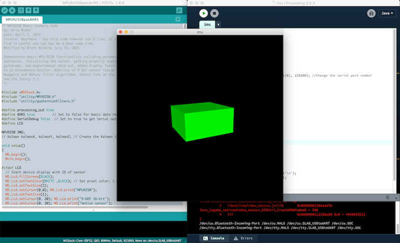

# M5Stack의 MPU9250을 사용한 Processsing example
M5Stack의 MPU9250 기본 예제인  MPU9250BasicAHRS.ino 파일을 수정하여 Processing과 연동이 되게 한다. 즉 M5Stack의 시리얼 출력값(yaw, pitch, roll)을 Processing에서 받아서 이미지를 회전시킴.

## M5Stack
- Processsing과 연동하기 위해 M5Stack의 MPU9250의 예제에서 다음과 같이 주석 부분을 수정한다. 
~~~cpp
#define processing_out true
#define AHRS true         // Set to false for basic data read
#define SerialDebug false  // Set to true to get Serial output for debugging
~~~
- loop()에서 다음과 같은 부분을 수정한다.
~~~cpp
#if(processing_out)
//      Serial.print(((IMU.yaw)));    Serial.print(";");
//      Serial.print(((IMU.pitch))); Serial.print(";");
//      Serial.print(((IMU.roll)));   Serial.print(";");
//      Serial.print(26.5);    Serial.print(";");
//      Serial.print(0.01);    Serial.print(";");
//      Serial.print(0.02);    Serial.println();
      Serial.print(((IMU.yaw)));    Serial.print(",");
      Serial.print(((IMU.pitch))); Serial.print(",");
      Serial.println(((IMU.roll)));   
#endif
~~~
 
## Processing
- Processing은 https://processing.org/download/ 에서 다운로드.
- 사용하는 시리얼 포트의 순서를 Serial.list()[*]에 적어준다. 
~~~cpp
    println(Serial.list());   // 시리얼 포트를 콘솔에 출력
    myPort = new Serial(this, Serial.list()[6], 115200); // 7번째 이므로 6으로 수정
~~~    
